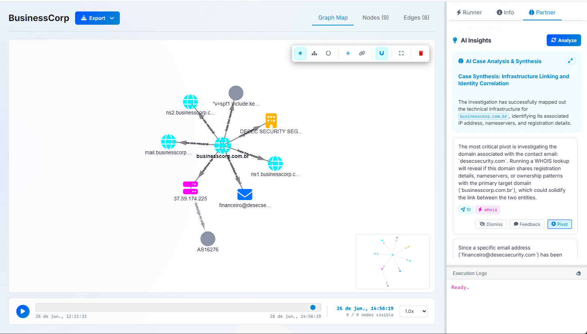
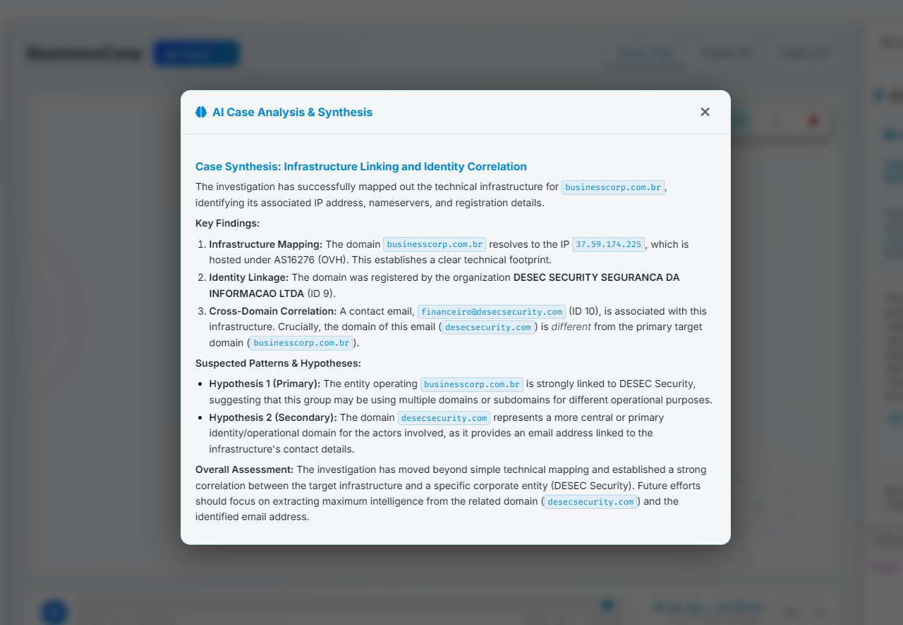
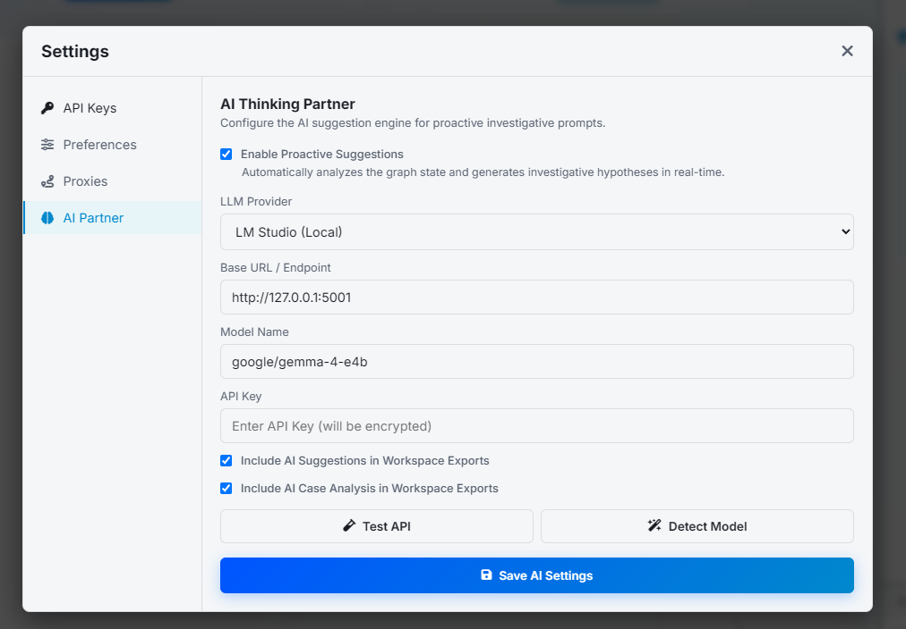

# AI Thinking Partner

The **AI Thinking Partner** is an advanced analysis engine built into Keen. It operates alongside you during an investigation, acting as a background collaborator. By continuously analyzing the active workspace's nodes, relationships (edges), and activity logs, the AI Thinking Partner synthesizes complex information, uncovers hidden links, and delivers actionable next steps.

---

## Key Features

- **Real-Time Case Analysis & Synthesis**: Generates structured, high-level intelligence reports summarizing your case, findings, and current hypotheses.
- **Actionable AI Suggestions**: Recommends immediate tasks (e.g., executing a specific module on an IP, email, or domain) to advance your investigation.
- **Interactive Suggestion Management**: Direct control to accept, reject, or dismiss recommendations directly inside the UI.
- **Seamless Export Integration**: Optional automated embedding of the AI's case analysis and suggestions into workspace reports (Markdown, HTML, and PDF).
- **Flexible LLM Configurations**: Compatible with popular cloud API providers (OpenAI, Anthropic) and local offline models (Ollama, LM Studio).

---

## The Partner Dashboard

The AI Partner's interface is located under the **Partner** tab in the right-hand panel of the Web UI.



### 1. AI Activity Logs
Displays a live terminal-style log of what the AI is analyzing, keeping its reasoning transparent (e.g., loading graph structures, calling LLM APIs, parsing discovered entities).

### 2. AI Case Analysis & Synthesis
Displays a comprehensive markdown-formatted summary of the active investigation, including:

- **Key Findings**: Discovered pivot points, high-severity indicators, or malicious clusters.
- **Investigative Hypotheses**: Potential scenarios explaining the relationships between nodes.
- **Identified Gaps**: Missing intelligence pieces that require further queries.

!!! tip "Full-Screen Reading (Expand Modal)"

    If the Case Analysis is long, click the **Expand** (diagonal arrows) button in the card header. This opens a dedicated, full-screen blur-overlay modal optimized for comfortable reading. The modal dynamically adapts to both Dark and Light themes.



### 3. Suggestions List
A list of specific, contextual recommendations based on the current state of the graph. Each suggestion displays:

- **Target Value**: The node name or value the suggestion concerns.
- **Recommended Action**: What module to run or what notes/relationships to check.
- **Context Badges**: Highlights the specific nodes that triggered this suggestion.

---

## Interacting with Suggestions

Every suggestion generated by the AI includes interactive controls:

1. **Accept (`Approve`)**:
   - Executes the recommended module or marks the task as approved.
   - Once approved, the card updates to green and executes the designated background task immediately.
2. **Reject (`Decline`)**:
   - Dismisses the suggestion, marking it as rejected (red card).
   - Helps the system avoid suggesting redundant steps in future cycles.
3. **Dismiss**:
   - Removes the suggestion from the active list.

---

## Integration with Workspace Exports

When generating reports to present to stakeholders, you can include the AI's insights automatically:

- **Markdown Export**: Appends a clear `# AI Case Analysis` section to the generated `.md` file, preserving clean headers, lists, and bold emphasis.
- **HTML/PDF Exports**: Formats the markdown case synthesis and suggestions into a beautiful, styled section using the core document stylesheet.

To toggle this behavior, check the respective options in the **Settings** panel under the **Preferences** tab.

---

## Configuration Preferences

To enable and configure the AI Thinking Partner, navigate to the **Settings & API Keys** modal in the Web UI, then select the **AI Partner** settings tab.



Alternatively, you can manage these preferences using the CLI `pref` command:

- `llm_thinking_partner_enabled`: (`true` or `false`) Toggle the entire AI analysis engine.
- `llm_provider`: (`openai`, `anthropic`, or `ollama`) Select the LLM provider.
- `llm_model`: The specific model identifier to use (e.g., `gpt-4o`, `claude-3-5-sonnet`, or `llama3`).
- `llm_base_url`: Custom endpoint URL (highly useful for local Ollama instances or custom API gateways).
- `llm_export_suggestions_enabled`: (`true` or `false`) Automatically include AI suggestions in workspace exports.
- `llm_export_analysis_enabled`: (`true` or `false`) Automatically include the AI Case Analysis report in workspace exports.

### Custom API Keys
Sensitive API keys (e.g., OpenAI or Anthropic tokens) are securely encrypted and managed through Keen's secure credential storage. Unlock the manager using your Master Password in the **Settings** tab to save or update your LLM credentials.

### Example CLI Configuration

```bash
# Enable the partner
keen > pref set llm_thinking_partner_enabled true

# Configure Ollama for local, private analysis
keen > pref set llm_provider ollama
keen > pref set llm_model llama3
keen > pref set llm_base_url http://localhost:11434/v1

# Enable export options
keen > pref set llm_export_analysis_enabled true
```
