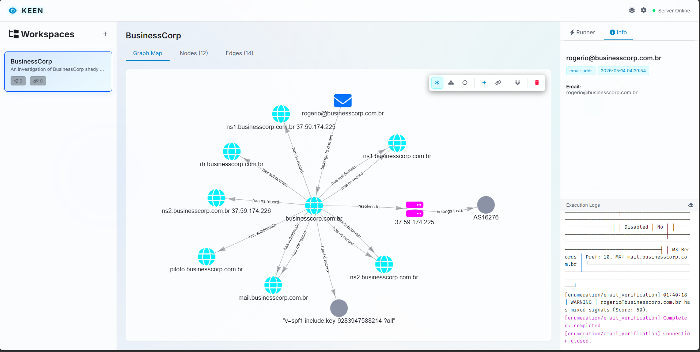
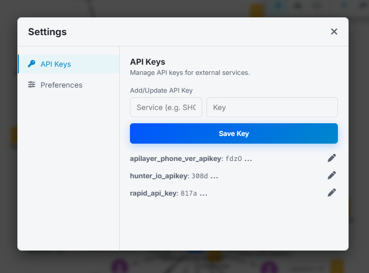

# Web Server & REST API

Keen provides a robust Web Server built on **FastAPI** and **Uvicorn**, enabling both an interactive visual dashboard and a fully documented RESTful API for integration and automation.

---

## Launching the Web Server

You can start the web server from your terminal or directly within the Keen interactive shell:

```bash
# From the command line
python keen.py --web --host 127.0.0.1 --port 8000

# With live reloading and debug logging enabled
python keen.py --web --host 127.0.0.1 --port 8000 --debug
```

Once running, the web server provides three primary interfaces:

- **Interactive UI Dashboard**: [http://127.0.0.1:8000/](http://127.0.0.1:8000/)
- **Interactive REST API Docs (Swagger UI)**: [http://127.0.0.1:8000/docs](http://127.0.0.1:8000/docs) (or via `/api`)
- **OpenAPI Schema**: [http://127.0.0.1:8000/openapi.json](http://127.0.0.1:8000/openapi.json)

---

## The Interactive UI Dashboard

Mounted at `/`, the web interface provides a rich environment for security investigators:

- **Graph Visualization**: Visually explore intelligence nodes and relationship edges. Drag, drop, and rearrange nodes to uncover connections. Node positions are automatically saved across sessions.
- **Case Management**: Switch between active workspaces, create new cases, or export complete intelligence graphs in standard formats.
- **Module Execution**: Configure target options and trigger reconnaissance modules directly from your browser.



---

## Settings & Preferences

The dashboard features a centralized settings menu that allows you to configure the application and manage sensitive credentials. The settings interface is organized into a two-panel layout with a navigation sidebar:



- **API Keys**: Manage third-party API keys for modules. To protect your credentials, this section is locked and requires you to enter your master password to view or modify keys.
- **Preferences**: Adjust UI behavior, global settings, proxy settings, and display settings. This section is accessible without needing to unlock the credential manager.

---

## REST API Endpoints

FastAPI automatically generates comprehensive OpenAPI documentation. Navigating to `/docs` allows you to inspect request schemas, test endpoints live, and review responses.

Below is an overview of the core REST API endpoints available:

### Workspace & Case Management
- `GET /api/workspaces`: Retrieve all registered workspaces along with active node and edge metrics.
- `POST /api/workspaces`: Create a new workspace database.
- `PUT /api/workspaces/{name}`: Rename an existing workspace.
- `DELETE /api/workspaces/{name}`: Delete a workspace from the registry.

### Intelligence Graph (Nodes & Edges)
- `GET /api/workspaces/{name}/nodes`: Fetch all intelligence nodes (STIX 2.1 / MISP objects) in a workspace.
- `POST /api/workspaces/{name}/nodes`: Manually create a custom intelligence node.
- `DELETE /api/workspaces/{name}/nodes/{node_id}`: Remove a specific node from the investigation graph.
- `GET /api/workspaces/{name}/edges`: Retrieve all relationship edges linking nodes.
- `POST /api/workspaces/{name}/edges`: Create a directional relationship between two nodes.
- `DELETE /api/workspaces/{name}/edges/{edge_id}`: Remove a relationship edge.
- `POST /api/workspaces/{name}/nodes/positions`: Update and persist 2D graph layout coordinates (`x`, `y`).

### Framework Configuration & Modules
- `GET /api/modules`: List all loaded intelligence modules and their required configuration options.
- `POST /api/config/unlock`: Unlock the secure credential manager using your master password.
- `GET /api/config/keys`: Retrieve all stored API key services (masked).
- `POST /api/config/keys`: Securely store a new third-party API key.

---

## Real-Time Execution via WebSockets

To support long-running reconnaissance tasks without blocking HTTP requests, Keen uses **WebSockets** for module execution:

```
Endpoint: ws://<host>:<port>/ws/modules/{module_name}/run
```

### Real-Time Log Streaming

When a WebSocket connection triggers an execution request, the server instantiates the module within an asynchronous task. It intercepts both structured debug logs and standard console output/error streams, streaming them back to the client in real time. This ensures investigators can monitor discovery progress, network probes, and scraped artifacts exactly as they occur.
